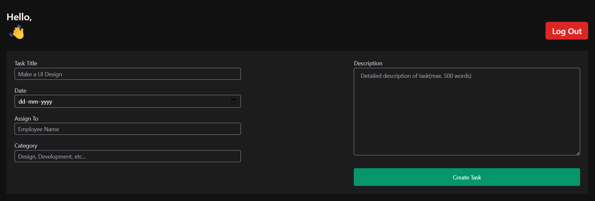
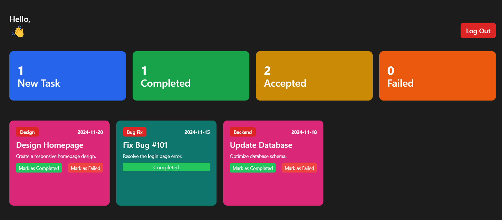
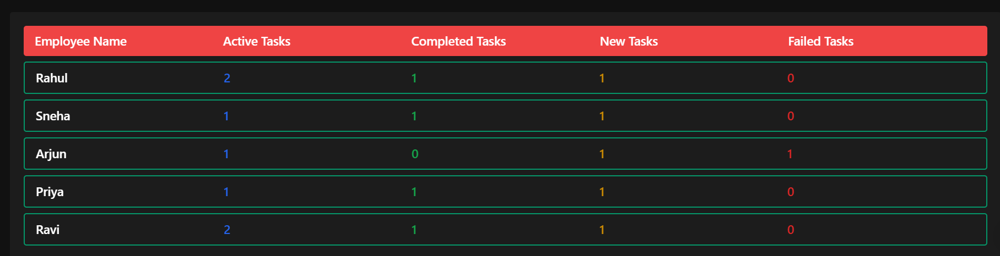

# 🏢 Employee Management System (EMS)

## 📌 Overview
The **Employee Management System (EMS)** is a React-based web application designed to streamline employee task management. It provides an **admin panel** for managing employees and assigning tasks, while employees can track their **new, active, completed, and failed tasks** in a structured manner.

## 🚀 Features
- 🏢 **Admin Panel**: Add employees, assign tasks, and track progress.  
- 👨‍💼 **Employee Dashboard**: View assigned tasks categorized by status.  
- 🔄 **Task Updates**: Employees can update task statuses.  
- 📊 **Responsive UI**: Built with **React & Tailwind CSS** for a seamless experience.  
- 💾 **Local Storage**: Stores data persistently without a backend.  

## 🦐 Tech Stack
- **Frontend:** React.js, Tailwind CSS  
- **State Management:** React Hooks  
- **Storage:** Local Storage  
- **UI Components:** ShadCN UI  

## 🖼️ Screenshots
### Admin Dashboard


### Employee Dashboard


### Task Management View


## 📺 Installation & Setup
```bash
# Clone the repository
git clone https://github.com/tushargithub52/EMS.git

# Navigate to the project folder
cd EMS

# Install dependencies
npm install

# Start the development server
npm start
```

## 🚀 Usage
- 🏢 **Admin**: Assign tasks to employees.  
- 👨‍💼 **Employees**: View tasks categorized as **New, Active, Completed, and Failed**.  
- ⏳ **Track Progress**: Admin and employees can monitor task updates.  

## 📝 Future Enhancements
- 🌐 **Integrate a Backend (Node.js & MongoDB)** for real-time data storage.  
- 🔔 **Add Notifications** for task updates.  
- 📈 **Analytics Dashboard** to track employee performance.  

## 📌 Contributing
Contributions are welcome! Feel free to **fork** this repository, create a **new branch**, and submit a **pull request**.  

## 📞 Contact
👤 **Tushar Rai**  
📧 [tusharraiku6020@gmail.com]  
🔗 [LinkedIn](https://www.linkedin.com/in/tushar-rai-7801a4254/)  
